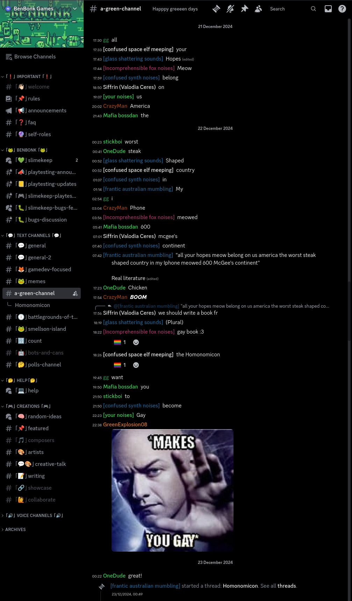
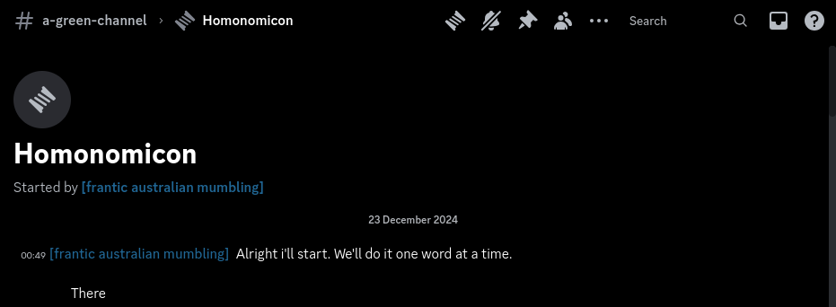

## Premise

The Homonomicon is "a gay book" written collectively by anyone who wants to participate. The only rules are that messages should be either single words or very short phrases, and that the same person shouldn't send more than one message in a row.

## Inception

The story of the Homonomicon happens on the BenBonk Games Discord server.

On the server, there are multiple high-slowmode channels. At the time of writing, there's #battlegrounds-of-time (formerly #6-hr-slowmode), as well as #a-green-channel (the current incarnation of the Christmas channel).

It's tradition on these high-slowmode channels for Green Guy (nickname *gg*, username `wd58`) to write out a song's lyrics one word at a time, regardless of the context of surrounding messages. This often leads to others building short chains of messages off of his singing.

It is one such chain that led to the creation of the Homonomicon's title:

The Homonomicon thread was started by TheMystZ (nickname *\[frantic australian mumbling\]*, username `themystz`):

